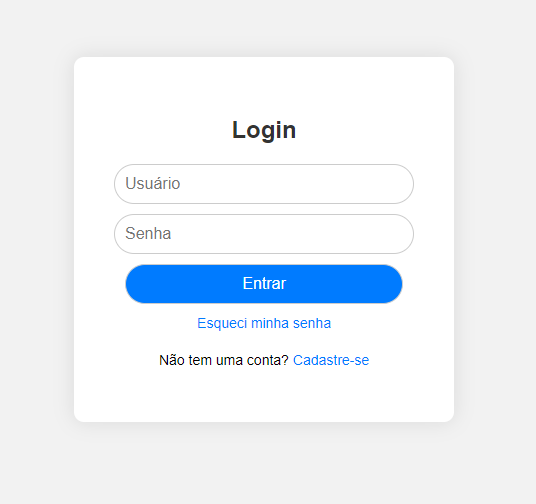

# telalogin

* [telalogin](#telalogin)
* [Descrição](#descrição)
* [Introdução](#introdução)
* [Funcionalidades](#funcionalidades)
* [Tecnologias Utilizadas](#tecnologias-utilizadas)
* [Autor](#autor)
 
 
## Descrição 📖
O projeto consiste no desenvolvimento de uma tela de login interativo para a empresa Alpha, utilizando JavaScript, HTML5 e CSS3. A tela permite ao usuário fazer login, cadastrar-se e recuperar sua senha, seguindo os padrões de autenticação usuais em aplicações web.

## Introdução ✉️
A empresa Alpha busca expandir suas operações e estabelecer uma equipe de TI própria. Para selecionar o candidato ideal para a vaga de Programador(a) Trainee, eles propuseram um desafio que envolve a criação ou utilização de um projeto de tela de login, com foco na validação dos campos de acesso e na implementação de uma página para recuperação de senha. 

## Funcionalidades 🧠
- Campo de usuário e senha para login.
- Opção para cadastro de novo usuário.
- Recuperação de senha através de e-mail.
- Validação dos campos de acesso (usuário e senha) utilizando JavaScript.
- Interface amigável e responsiva.

## Tecnologias Utilizadas 🖥️  
- Visual Studio Code
- CSS3
- GitHub
- Git
- HTML5
- JavaScript

 
## Autores 👥
- [Naillim Novaski](https://github.com/naillimnovaski)

